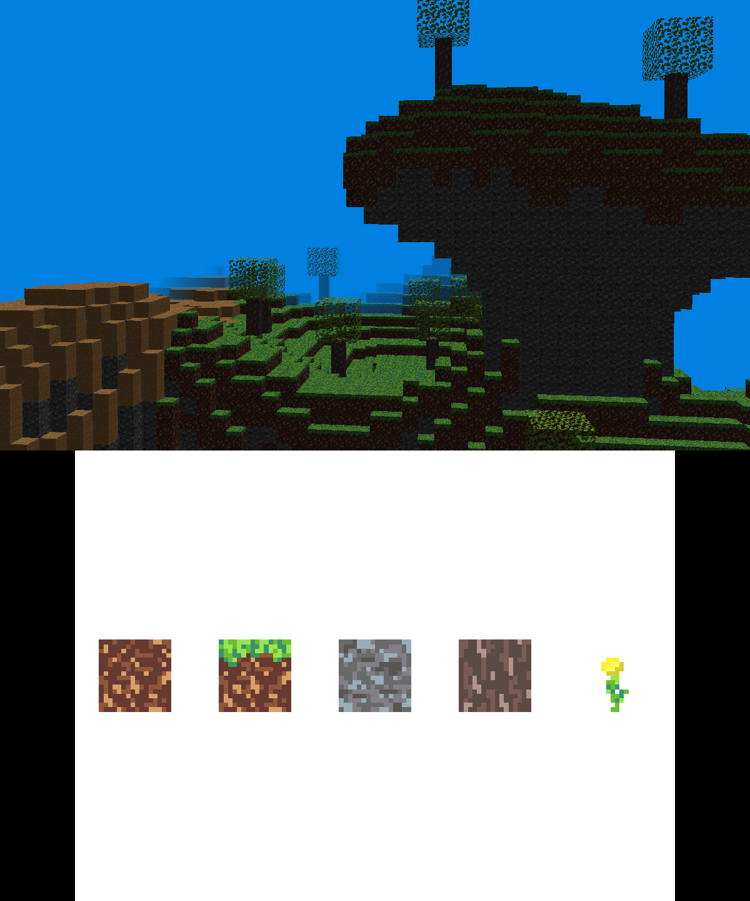

# Minecraft clone for 3DS

This is a simple Minecraft clone for the 3DS. It is written in C++ using the libctru and citro3d libraries. It features face culling, physics, and block breaking and placing. It doesn't include some of the more advanced features like lighting, translucency and greedy meshing.

The game can be saved by pressing the start button. The save file is stored on the SD card and is automatically loaded at startup. If you want to start a new file, you can delete the save file located at `sdmc:/minecraft_clone_save.dat`.

## Controls

| Button      | Action                                                                                    |
| ------------| ----------------------------------------------------------------------------------------- |
| Circle Pad or touchscreen | Rotate the camera
| D-Pad                     | Move
| A or B                    | Jump
| X or Y                    | Run
| L                         | Place block
| R                         | Break block
| Start                     | Save the game

You can choose which block to place by touching one of the blocks on the bottom screen.

## Usage

A .3dsx build is available in [releases](https://github.com/SamoZ256/minecraft-clone-3DS/releases/tag/v0.0.1), which can be run on a 3DS emulator (like Citra). I haven't been able to build for a real 3DS, since that requires [bannertool](https://github.com/Steveice10/bannertool/), but the repository doesn't seem to exist anymore. To build the project yourself, follow the instructions below.

### Building

Invoke `make` to build the project. The following targets are available:

| Targets     | Action                                                                                    |
| ------------| ----------------------------------------------------------------------------------------- |
| 3dsx        | Builds `<project name>.3dsx` and `<project name>.smdh`.
| elf         | Builds `<project name>.elf`.

### Setting up devkitPro
* Follow the steps installing devkitPro at the gbatemp [wiki](https://wiki.gbatemp.net/wiki/3DS_Homebrew_Development#Install_devkitARM)

## Credits
This project is based on the awesome [3DS homebrew template](https://github.com/TricksterGuy/3ds-template).
